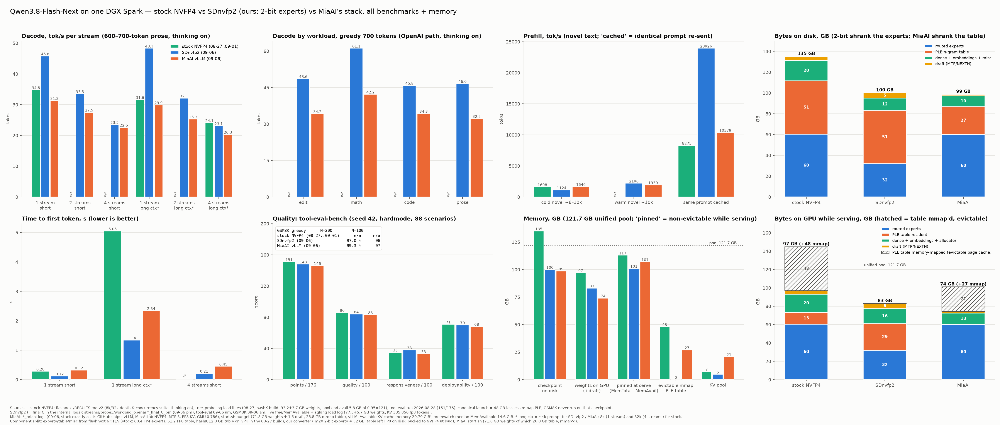

# Qwen3.8-Next SDnvfp2 — 2-bit-expert Qwen3.8-Flash-Next on one DGX Spark

SDnvfp2 is a quantised build of **Qwen3.8-Flash-Next** (180B-parameter MoE, 262k context) that
runs on a **single DGX Spark (GB10, 128 GB unified memory)** with sglang. The routed experts are
stored at **2 bits per weight** and read by a dedicated Triton kernel; the dense layers and the PLE
n-gram table are NVFP4; speculative decoding (NEXTN, 4 draft tokens) runs with a reduced draft
vocabulary. This repository holds everything needed to **run** it: the patched sglang files, the
model files, the launcher, the benchmark scripts and the measurements. The weights are on
Hugging Face (see *Get the weights*).



## Numbers (measured 2026-09-06 on one DGX Spark; MiaAI's stack run as its GitHub ships, same day, same probes)

| | **SDnvfp2** | MiaAI vLLM NVFP4 | stock NVFP4 (own suite, Aug 27–Sep 1) |
|---|---|---|---|
| decode, 1 / 2 / 4 streams, short prose, tok/s per stream | **45.8 / 33.5 / 23.5** | 31.3 / 27.5 / 22.6 | 34.8 / – / – |
| decode at ~4k context, 1 / 2 / 4 streams | **48.3 / 32.1 / 23.1** | 29.9 / 25.3 / 20.3 | 31.6 (8k) / – / 24.1 (32k) |
| time to first token, short / 4k, 1 stream | **0.12 s / 1.3 s** | 0.32 s / 2.3 s | 0.28 s / 5.1 s (8k) |
| decode by workload (greedy): edit / math / code / prose | **48.6 / 61.1 / 45.8 / 46.6** | 34.2 / 42.2 / 34.3 / 32.2 | – |
| novel prefill ~10k tokens, cold / warm | 1124 / **2190** | 1646 / 1930 | 1608 / – |
| GSM8K-300 greedy | 97.0 % | **99.3 %** | not run |
| tool-eval-bench (88 scenarios, seed 42, hardmode) | 148 / 176, quality 84 | 146 / 176, quality 83 | 151 / 176, quality 86 |
| checkpoint on disk | 100 GB (+1.8 GB dense codes) | 99 GB | 135 GB |
| weights on the GPU while serving | 83 GB | 74 GB + 27 GB mmap table | ~97 GB + 48 GB mmap table |
| pinned memory while serving (of 121.7 GB) | 101 GB | 107 GB | ~113 GB |

Reading: SDnvfp2 is the fastest of the three at 1–2 streams (+46 % / +22 % vs MiaAI at 1 / 2
streams) and has the lowest first-token latency; all three converge at 4 streams where the box is
bandwidth-bound. MiaAI's NVFP4 checkpoint is more accurate on GSM8K-300 by 2.3 points; tool
calling is a tie. Every value in the chart carries its source in the footer.

## Requirements
* DGX Spark (GB10, sm_121, 128 GB unified). Nothing else was tested.
* Docker with GPU access and the image `lmsysorg/sglang:qwen38flashnext` (~30 GB).
* ~105 GB of disk for the weights + dense codes; ~101 GB of the unified pool while serving
  (`MEMFRAC=0.80`). Do not run another GPU job beside it.

## Get the weights
The weights (207 safetensors shards + tokenizer files, ~98 GB) and the `dense_codes/` sidecar
directory (1.8 GB) are one Hugging Face repository:

```bash
pip install -U huggingface_hub
hf download sdworld/Qwen3.8-Next-SDnvfp2 --local-dir ./Qwen3.8-Next-SDnvfp2
```

## Run
```bash
docker pull lmsysorg/sglang:qwen38flashnext
git clone <this repo> && cd Qwen3.8-Next-SDnvfp2
CKPT=/path/to/Qwen3.8-Next-SDnvfp2 ./run.sh          # port 8934, model name "sdnvfp2"
docker logs -f sdnvfp2                                   # first load ~10–12 min: the PLE table is packed to NVFP4 at load
curl -s localhost:8934/health && curl -s localhost:8934/v1/chat/completions -H 'Content-Type: application/json' \
  -d '{"model":"sdnvfp2","messages":[{"role":"user","content":"Explain speculative decoding in two sentences."}],"max_tokens":200}'
./stop.sh
```

`run.sh` knobs (env vars): `PORT`, `NAME`, `CTX` (default 32768; the model supports 262144 — raise
`CTX` and lower nothing else, the KV pool is what remains after weights), `MEMFRAC` (0.80; the
loader prints its minimum, 0.75 is enough on some launches), `ACC` (speculative accept threshold,
0.7; affects sampled traffic only, set 1.0 for strict rejection sampling), `CODES` (dense codes
dir if not inside the checkpoint), `VISION=1` to load the vision tower (default text-only: every number above
was measured with `--language-only`; the tower is in the checkpoint and answered an image test on an earlier
build, but vision on this exact build is unmeasured and costs a few GB of the pool). Extra arguments are passed to `sglang.launch_server`. The
OpenAI-compatible API is at `/v1`; thinking is on by default (`reasoning_content` is returned
separately); tools work with the `qwen3_coder` parser.

## Verify on your box
```bash
python3 bench/bench_repeat.py 8934 mybox                 # 1 stream/4k, 2 streams short, 2 streams 4k; decode excludes TTFT
python3 bench/probe_streams.py 8934 mybox 1,2,4          # per-stream tok/s and TTFT at 1/2/4 streams
N=300 THREADS=4 BENCH_BASE=http://127.0.0.1:8934/v1 BENCH_MODEL=sdnvfp2 python3 bench/gsm8k_eval_greedy.py
python3 bench/tool_call_eval.py 8934 mybox 3             # 20 tool-calling tasks, greedy + 3 sampled seeds
```
Expect the SDnvfp2 column above within ±10 % (this class of box drifts that much day to day).

## Known behaviour
* Under sampling, with many tool schemas in the prompt and **no system prompt**, the model
  occasionally ends its turn right after the think block with an empty answer (seen on every
  build of this model incl. FP8 and NVFP4 ones). Send a system prompt or disable thinking
  (`chat_template_kwargs: {"enable_thinking": false}`) for tool traffic; both measured 0 / 60.
* Greedy decoding is not bit-reproducible run to run (fused-kernel atomics); GSM8K-100 moves ±2.
* First load packs the 51 GB PLE table to NVFP4 in memory (~8 min); later loads are the same
  because nothing is cached to disk yet.

## What is in here
```
run.sh / stop.sh            launcher (bind-mounts everything below over the stock image; nothing is installed)
model/                      qwen4_exp.py (model with 2-bit experts, NVFP4 dense/PLE, draft slice), qwen4_exp_mtp.py (draft)
sglang_patched/             the 4 sglang files carrying the W2A16 expert kernel and its dispatch
flashnext/                  4 Flash-Next support files for this image (loader, sparse attention, flash-attn forward)
checkpoint_config/          config pair the modelopt_fp4 parser expects (copied into the serving view)
sidecars/                   draft_vocab_top65536.pt (draft-head vocabulary)
bench/                      the scripts behind the numbers above
docs/                       the benchmark chart
```
See `NOTICE` for the provenance of the modified files. The weights on Hugging Face are under the Qwen Community
License 1.0 (`LICENSE-QWEN-WEIGHTS`, copied from the base model): redistribution of derivatives is permitted with
that notice; no commercial model-as-a-service / AI-assistant use without a separate Qwen license.
